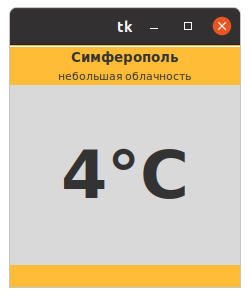
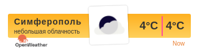
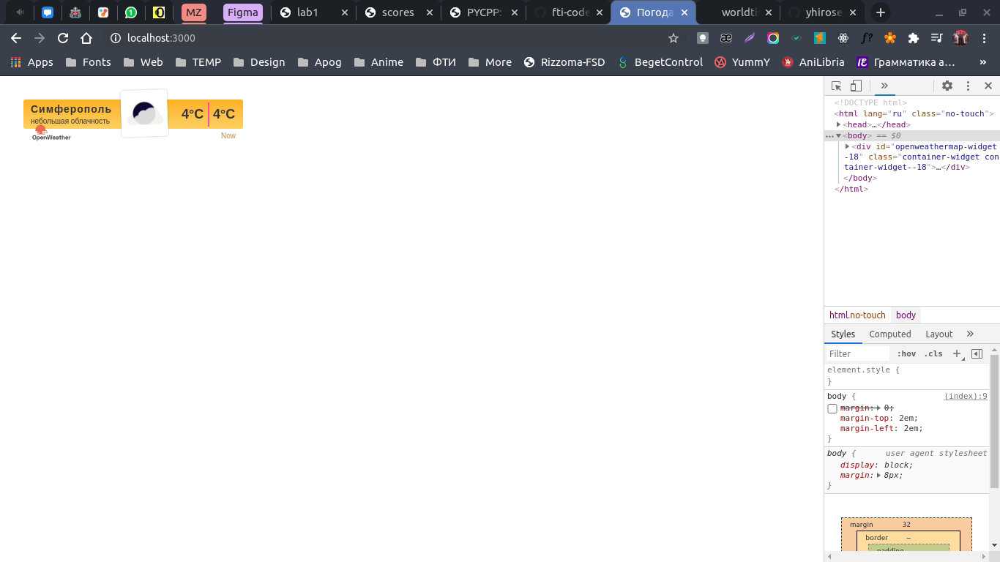

<p align="center">МИНИСТЕРСТВО НАУКИ  И ВЫСШЕГО ОБРАЗОВАНИЯ РОССИЙСКОЙ ФЕДЕРАЦИИ<br>
Федеральное государственное автономное образовательное учреждение высшего образования<br>
"КРЫМСКИЙ ФЕДЕРАЛЬНЫЙ УНИВЕРСИТЕТ им. В. И. ВЕРНАДСКОГО"<br>
ФИЗИКО-ТЕХНИЧЕСКИЙ ИНСТИТУТ<br>
Кафедра компьютерной инженерии и моделирования</p>
<br>
<h3 align="center">Отчёт по лабораторной работе № 1<br> по дисциплине "Программирование"</h3>
<br><br>
<p>студента 1 курса группы ПИ-б-о-201(2)<br>
Никонова Фёдора Андреевича<br>
направления подготовки 09.03.01 "Программная инженерия"</p>
<br><br>
<table>
<tr><td>Научный руководитель<br> старший преподаватель кафедры<br> компьютерной инженерии и моделирования</td>
<td>(оценка)</td>
<td>Чабанов В.В.</td>
</tr>
</table>
<br><br>
<p align="center">Симферополь, 2020</p>
<hr>

## Постановка задачи

Разработать сервис предоставляющий данные о погоде в городе Симферополе на момент запроса.  В качестве источника данных о погоде используйте: http://openweathermap.org/. В состав сервиса входит: серверное приложение на языке С++ и клиентское приложение на языке Python.

Серверное приложение (далее Сервер) предназначенное для обслуживания клиентских приложений и минимизации количества запросов к сервису openweathermap.org. Сервер должен обеспечивать возможность получения данных в формате JSON и виде html виджета (для вставки виджета на страницу будет использоваться iframe).

Клиентское приложение должно иметь графический интерфейс отображающий сведения о погоде и возможность обновления данных по требованию пользователя.

## Цель работы
Целью работы является научится создавать приложения с клиент-серверной архитектурой.

Каталоги:
[[C++]](./C++) [[Python]](./Python)
## Выполнение работы

Сперва было выполнено ознакомление с api openweathermap и worldtimeapi. На практике были выведены требуемые запросы.

Далее был разработан сервер. Разработка происходила в два этапа, согласно заданным роутам:

1. Разработка обработчика на роут "/"
2. Разработка обработчика на роут "/raw"

Оба роута имеют повторяющийся код, который был выделен в отдельные файлы, благодаря чему была достигнута высокая читабельность программного кода.

Выделенные код был разбит на файлы и помещён в папку `tools`. Сами роуты находятся в папке `routes`. Каждый файл имеет защиту от повторного подключения, что позволяет избежать ошибок и оптимизировать процесс сборки и выполнения программы.

Все файлы подключаются в `01.cpp`, который является входной точкой в проект и содержит функцию *main*.

Во время работы сервера в консоль выводится отладочная информация, позволяющая отследить работу сервера и отловить возникающие ошибки.

### Информация о проекте

Используется последний **стандарт языка** С++ на текущий момент (20.11.2020): `С++17`

**Сборщик**: `gcc v10.2.0` на операционной системе `Ubuntu 20.04.01 LTS`

### Обязательная информация

1. На сайте openweathermap.org был получен следующий ключ api: **c59cd208b47baa4b871e2d31b36ea921**
2. В пункте 1.7 составлен следующий запрос: http://api.openweathermap.org/data/2.5/onecall?lat=44.95719&lon=34.11079&exclude=current,minutely,daily,alerts&units=metric&lang=ru&appid=c59cd208b47baa4b871e2d31b36ea921
3. В пункте 2 составлен следующий запрос: http://worldtimeapi.org/api/timezone/Europe/Simferopol
4. Полный исходный код Сервера:
```c++
#include <iostream>
#include <experimental/filesystem>
namespace fs = std::experimental::filesystem;

#include "./include/cpp_httplib/httplib.h"
using namespace httplib;

#include "./include/json/json.hpp"
using json = nlohmann::json;

#include <vector>
#include <string>

#include <fstream>
#include <sstream>

// -------
// <TOOLS>
// -------

// Weather.cpp
class Weather
{
public:
   int temp;
   std::string descr;
   std::string icon;
   Weather() {}
   Weather(json weatherData)
   {
      temp = (int)weatherData["temp"].get<float>();
      descr = weatherData["weather"][0]["description"].get<std::string>();
      icon = weatherData["weather"][0]["icon"].get<std::string>();
   }

   static std::string options()
   {
      const std::string weatherKey = "c59cd208b47baa4b871e2d31b36ea921";
      std::vector<std::string> weatherOpt{
          "lat=44.95719",
          "lon=34.11079",
          "exclude=current,minutely,daily,alerts",
          "units=metric",
          "lang=ru",
          "appid=" + weatherKey};

      std::string weatherOptStr = "";
      for (auto optPart : weatherOpt)
         weatherOptStr += "&" + optPart;
      weatherOptStr = "/data/2.5/onecall?" + weatherOptStr.substr(1);
      return weatherOptStr;
   }
};
std::string weatherOptStr;
std::string weatherWidget;
int prevtime;
Server server;
Weather *weather;

// askUrl.cpp
void askUrl(std::string domain, std::string path, std::function<void(Result &)> okCallback)
{
   Headers headers = {{"Accept-Encoding", "gzip, deflate"}};
   printf("\nAsking %s%s\n", domain.c_str(), path.c_str());
   Client client(domain.c_str());
   auto res = client.Get(path.c_str(), headers);
   if (res)
   {
      if (res->status == 200)
         okCallback(res);
      else
         std::cout << "Error. Status code: " << res->status << std::endl;
   }
   else
      std::cout << "Error. On result execute, error code: " << res.error() << std::endl;
}

// iofile.cpp
std::string readFile(const std::string &path)
{
   std::ifstream file(path);
   return std::string((std::istreambuf_iterator<char>(file)), std::istreambuf_iterator<char>());
}

void writeFile(const std::string &path, const std::string &data)
{
   std::ofstream file;
   file.open(path);
   file << data;
   file.close();
}

// replaceAll.cpp
std::string replaceAll(std::string str, const std::string &from, const std::string &to)
{
   size_t start_pos = 0;
   while ((start_pos = str.find(from, start_pos)) != std::string::npos)
   {
      str.replace(start_pos, from.length(), to);
      start_pos += to.length(); // Handles case where 'to' is a substring of 'from'
   }
   return str;
}

// timeCheck.cpp
int needUpdateByTime(int prevtime, int unixtime)
{
   int unixHours = unixtime / 3600, prevHours = prevtime / 3600;
   return unixHours - 1 >= prevHours;
}

extern int prevtime;

bool needNewWeather()
{
   bool needNew = false;
   askUrl("http://worldtimeapi.org", "/api/timezone/Europe/Simferopol", [&](Result &res) {
      auto timeJson = json::parse(res->body);
      auto unixtime = timeJson["unixtime"].get<int>();

      printf("unixtime(%d) %s prevtime(%d)\n", unixtime, (unixtime > prevtime ? ">" : "<"), prevtime);

      needNew = unixtime && needUpdateByTime(prevtime, unixtime);
      prevtime = unixtime;
   });

   return needNew;
}

//trimRStr.cpp
std::string trimRStr(std::string str, std::string ch)
{
   int len = str.length();
   std::string rch = str.substr(len - 1);
   while (rch == ch)
   {
      str = str.substr(0, len - 1);
      len--;
      rch = str.substr(len - 1);
   }

   return str;
}

// weatherUpdate.cpp
void weatherUpdate()
{
   askUrl("http://api.openweathermap.org", weatherOptStr, [&](Result &res) {
      auto weatherJson = json::parse(res.value().body);
      auto weatherData = weatherJson["hourly"][0];
      weather = new Weather(weatherData);
   });
}

// --------
// </TOOLS>
// --------

// --------
// <ROTES>
// --------

// root.cpp
void rootRoteHandler(const Request &req, Response &res)
{
   if (needNewWeather())
      weatherUpdate();
   else
      std::cout << "Weather update skip, cash is OK." << std::endl;

   std::cout << std::endl
             << "descr: " << (weather->descr) << std::endl
             << "temp: " << (weather->temp) << std::endl;

   std::string responseHtml = weatherWidget;
   std::map<std::string, std::string> replacements = {
       {"{{description}}", (weather->descr)},
       {"{{temp}}", trimRStr(trimRStr(std::to_string(weather->temp), "0"), ".")},
       {"{{icon}}", (weather->icon)},
   };

   for (auto const &[from, to] : replacements)
      responseHtml = replaceAll(responseHtml, from, to);

   res.set_content(responseHtml.c_str(), "text/html");
}

// raw.cpp
void rawRoteHandler(const Request &req, Response &res)
{
   if (needNewWeather())
      weatherUpdate();
   else
      std::cout << "Weather RAW update skip, cash is OK." << std::endl;

   std::cout << std::endl
             << "descr: " << (weather->descr) << std::endl
             << "temp: " << (weather->temp) << std::endl;

   res.set_content(json{{"temp", (weather->temp)}, {"descr", (weather->descr)}}.dump(), "text/json; charset=UTF-8");
}

// --------
// </ROTES>
// --------

int main()
{
   // running on repo root
   auto cwd = fs::current_path().string();

   weatherOptStr = Weather::options();
   prevtime = 0;
   weatherWidget = readFile(cwd + "/Programming/Labs/01/C++/widget.html");

   server.Get("/", rootRoteHandler);
   server.Get("/raw", rawRoteHandler);

   // STARTING SERVER
   std::cout << "Server served on localhost:3000\n";
   server.listen("localhost", 3000);

   return 0;
}
```
5. Полный код Клиента:
```py
from tkinter import *
import requests
from requests.exceptions import InvalidSchema

root = Tk()

try:
   weather = requests.get('http://localhost:3000/raw', headers={'Content-type': 'text/json; charset=UTF-8'}).json()
except InvalidSchema:
   print('Can\'t connect to server. Exit')
   exit()

temp = str(weather['temp']).split('.')[0]

top = Frame(root, background="#ffbd37").pack(side=TOP, fill=X)
middle = Frame(root, background="white").pack(side=TOP, fill=BOTH)
bottom = Frame(root, background="#ffbd37").pack(side=BOTTOM, fill=X)

Label(top, 
   text="Симферополь", 
   bg="#ffbd37", 
   fg="#333333",
   font=('sans-serif', 10, 'bold')).pack(fill=X)
Label(top, 
   text=weather['descr'], 
   bg="#ffbd37", 
   fg="#333333",
   font=('sans-serif', 8)).pack(fill=X)
Label(middle, 
   text=(temp + '°C'), 
   padx=50, 
   pady=50,
   fg="#333333",
   font=('sans-serif', 50, 'bold')).pack(fill=X)
Label(bottom, bg="#ffbd37").pack(fill=X)

root.mainloop()
```
6. Скриншот клиентского приложения:



7. Скриншот браузерного виджета:






Каталоги:
[[C++]](./C++) [[Python]](./Python)
## Вывод
Все поставленные задачи выполнены, а цель работы достигнута - разработано многомодульное клиент-серверное приложение, позволяющее узнать погоду на текущий момент времени. 

В разработке сервера использованы две сторонние библиотеки: json и cpp-httplib. Клиент использует библиотеку TKinter для отрисовки пользовательского интерфейса.

Практика показывает, что любое приложение рано или поздно требует хранения информации на серверах, поэтому умение разрабатывать клиент-серверные приложения является важным навыком в современном мире программирования.